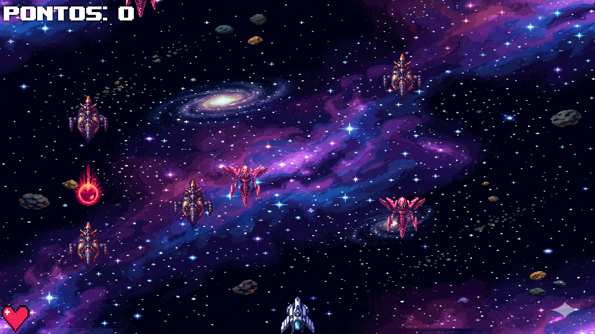

# 🚀 Boomer Galaxy

Boomer Galaxy é um jogo de nave no estilo Shoot 'em Up (retro arcade) com rolagem vertical, desenvolvido no motor gráfico Unity. Enfrente ondas de inimigos no espaço profundo, colete power-ups e sobreviva o máximo que puder!



## 🎮 Funcionalidades do Jogo
Movimentação Fluida: Controle total da nave utilizando o New Input System da Unity, suportando teclas WASD e Backspace.

## 🕹️ Como Jogar
- Movimentar: Use as teclas W, A, S, D ou as Setas do teclado.
- Atirar: Pressione a tecla Espaço.
- Objetivo: Destrua os inimigos e evite ser atingido. Se sua vida chegar a 0, é Game Over!.

### 🎰 Power-ups de Boomer-Galaxy

1. ☄️**Laser Duplo (Upgrade Ofensivo)**

Este power-up transforma a capacidade de ataque da sua nave, permitindo que tu atire lasers duplos.

Vantagem Estratégica: Além de dobrar o dano por clique, ele aumenta a sua área de cobertura horizontal, facilitando atingir inimigos que não estão diretamente na sua frente.

2. 🛡️ **Escudo (Upgrade Defensivo)**

O escudo é a sua "segunda chance" contra os perigos do espaço sideral.

Proteção de Vida: O jogador possui uma vida máxima de 3 corações e quando tu tem o Escudo Ativo ele protege sua vida e o dano é asorvido por ele.

Vantagem Estratégica: Permite que você jogue de forma mais agressiva ou escape de situações de "cerco" sem perder o progresso da partida.

### 👾 Sistema de Combate:

- Disparo único centralizado por padrão. 
- Power-up de Laser Duplo: Ativa disparos simultâneos das laterais da nave para dobrar o poder de fogo.
- Sistema de Vida e Defesa:
- O jogador inicia com um máximo de 3 vidas.
- Interface de usuário (UI) intuitiva com ícones de corações pixel art para vida do Jogador.
- Mecânica de Escudo: Quando ativo, protege o jogador de perder vida ao receber dano.
- Interface Completa: Menu de Game Over com pontuação final e botões para reiniciar ou sair do jogo.

## 🛠️ Tecnologias Utilizadas

Engine: Unity 2022+ (ou versão superior).

Linguagem: C# (Scripts de controle e lógica de vida).

Input: Unity Input System Package.

UI: TextMesh Pro para textos de alta definição.

Versionamento: Git & GitHub.

## 🚀 Como Rodar o Projeto

Clone este repositório:
```
bash
git clone https://github.com/Jotshh/Boomer-Galaxy.git
```
Abra o Unity Hub.

Clique em Add e selecione a pasta do projeto.

Certifique-se de ter o pacote Input System instalado via Package Manager.

Abra a cena principal em Assets/Scenes e divirta-se!

## ⚖️ License

MIT License

## 📩 Contato

josiephelipel265@gmail.com
